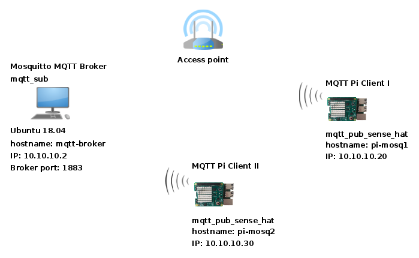

## MQTT subscriber and publisher examples in C/C++ with libmosquitto

This project demonstrates the use of [MQTT](http://mqtt.org) protocol for collecting environment data (pressure, temperature and humidity) with MQTT clients distributed on multiple locations, running on Raspberry Pi with Pi Sense HAT attached. [libmosquitto](https://mosquitto.org/) is selected for impleneting MQTT subsriber and publisher code in C/C++, while  [Mosquitto](https://mosquitto.org/) is MQTT broker of choise for testing the implementation.

### Project components

Three MQTT clients are included in the project:
 
- **mqtt\_sub**: a suibscriber to ambient data topic;
- **mqtt\_pub**: a publisher of dummy/test ambient data (used for testing the MQTT setup);
- **mqtt\_pub\_sense\_hat**: same as mqtt_pub, but it uses the sensors on **Raspberry Pi Sense HAT** for providing actual ambient data. 

### How it works

- Client **mqtt\_sub**. It subscribes to every topic on the broker that starts with *home* and ends with *ambient\_data* (*"home/+/ambient_data"*). The loop for recieving MQTT messages runns in a separate thread. The received payload will end up in a FIFO queue. Additional worker thread will process every payload entry from the queue by calling the process_message() function. In this example, the function only prints the payload on a standard console. 

- The publisher **mqtt\_pub** writes on the topic either dummy or real environment data it collects for its location. The client publishes the MQTT message in a loop.

Supported command line arguments:

     -b <hostname/IP of the broker> default value: localhost;
     -p <port number> default value: 1883;
     -l <location> default value: location_<pid of the process>, ignored by mqtt\_sub if given.

The client will use the default values for the missing arguments. 

#### MQTT message format

The MQTT message carries control and payload data. The payload consist of: location name, temperature, pressure and humidity. 

All MQTT messages are send with *QoS (quality of service) flag* set to 0, and *retain* field set to *false*.
The clients neither support MQTT authentication nor they can establish a secure connection with the broker over SSL channel.

### Software Requirements  and Tools

 - Libmosquitto library;
 - [Libsetila](https://github.com/positronic57/libsetila) for Pi Sense HAT envirement sensors support;
 - CMake for building the project from source;
 - Mosquitto broker for testing the clients functionallity.
 
### Supported Hardware Platforms

The code should work on all platforms capable of running Linux with multithreading, and are supported by libmosquitto. 
Only the mqtt\_pub\_sense\_hat is written for Raspberry Pi with Pi Sense Hat, althoug if will work on other embedded systems with LPS25H and HTS221 sensors attached.

## Installation

Before building the source code on Ubuntu or Raspbian, make sure that libmosquitto-dev package is already installed. The package is available in the official Ubuntu and Raspbian repositories. 

For Pi Sense HAT support, first install *[libsetila](https://github.com/positronic57/libsetila)* library. Check libsetilla installation manual for the instructions.

CMake tool is selected for building the clients from the source. It is an out-of-source build which requires a 
separate foder for the compiling process. Navigate to the project folder, create a new subfolder and jump inside:

    #mkdir build && cd build

Execute the following command in order to create a building instructions for the release version of the binaries:

    #cmake -DCMAKE_BUILD_TYPE=Release

or

    #cmake -DCMAKE_BUILD_TYPE=Debug

for debug version.

The last two commands will generate rules for building mqtt\_sub and mqtt\_pub binaries only. For getting mqtt_pub_sense_hat build, use additional argument -DWITH_PI_SENSE_HAT=ON:

    #cmake -DCMAKE_BUILD_TYPE=Release -DWITH_PI_SENSE_HAT=ON ..
    
 After Cmake will generate the build scritps, compile the clients with:
 
     #make
 
 In order to install the binaries in the *bin* folder under the project tree use:
 
    #make install

### Deployment and testing

There are different depolyment scenarios depending where the MQTT broker and client will be hosted/running. 
One of the posible implementations is presented on the diagram below.

In this example, *the broker* and *mqtt_sub *run on a same *Ubuntu 18.04 host* or the collector node, while *mqtt\_pub\_sense\_hat clients* will be started on two *Raspberry Pi* with *Pi Sense HAT* running Raspbian. Those are the publishing nodes.

#### Prepearing the collector node

Bild the project on the collector node to get mqtt\_sub client binary. Next step is Mosquitto broker installation.

Mosquitto broker is available in the official Ubuntu repositories. Use the command below for installing the broker package:

    #sudo apt-get install mosquitto

Configure Mosquitto. The default configuration is enough for using the broker with the clients.

Check if the broker is up and running. Seach for mosquitto string in the output of netstat command:

    #sudo netstat -tlnp | grep mosquitto
		  
The last command should produce the foloowing output:
		
    tcp        0      0 0.0.0.0:1883            0.0.0.0:*               LISTEN      9847/mosquitto
		
    tcp6       0      0 :::1883                 :::*                    LISTEN      9847/mosquitto
	
Start Mosquitto broker if it is not already running.

    #sudo systemctrl start mosquitto.service

Optional, configure Mosquitto to start at boot automatically:

    #sudo systemctrl enable mosquitto.service

#### Publishers

Install the prerequisits required for building mqtt\_pub\_sense\_hat on Raspberry Pi with Sense HAT. Build the binary from source.

#### Test

MQTT broker should be already running on the system, waiting to manage MQTT messages. Start the subscriber client on the collector node.  To do so, in the command line, navigate to the bin folder under the project folder and start the binary:

    #cd <project_folder>/bin
    #./mqtt_sub

Because it runns on the same host as the broker, no arguments for broker hostname and port are required. 

After the subscriber is running, start the mqtt\_pub or mqrr\_pub\_sense\_hat processes on the Pi client(s):

    #cd <project_folder>/bin
    
    #./mqtt_pub_sense_hat -b mqtt-broker -l kitchen

Or with IP addess of the broker machine (10.10.10.2 on the deployment diagram) as a velue for the -b argument:

    #./mqtt_pub_sense_hat -b 10.10.10.2 -l kitchen

On the second Pi, mqtt_pub will be started without providing the location info:

    #./mqtt_pub -b mqtt-broker
    
Mqtt\_sub will print the received ambient data in the console where is was started:

    03.May.2020 14:55:17 [kitchen] t = 32.21[°C], p = 1001.39[hPa], H = 35.20[%rH]
    03.May.2020 14:55:17 [location_13321] t = 25.30[°C], p = 995.30[hPa], H = 33.00[%rH]
    03.May.2020 14:55:18 [kitchen] t = 32.20[°C], p = 1001.38[hPa], H = 35.20[%rH]
    03.May.2020 14:55:18 [location_13321] t = 25.30[°C], p = 995.30[hPa], H = 33.00[%rH]
    03.May.2020 14:55:19 [kitchen] t = 32.21[°C], p = 1001.37[hPa], H = 35.20[%rH]
    03.May.2020 14:55:19 [location_13321] t = 25.30[°C], p = 995.30[hPa], H = 33.00[%rH]
    03.May.2020 14:55:20 [kitchen] t = 32.21[°C], p = 1001.37[hPa], H = 35.20[%rH]
    03.May.2020 14:55:20 [location_13321] t = 25.30[°C], p = 995.30[hPa], H = 33.00[%rH]
    03.May.2020 14:55:21 [kitchen] t = 32.22[°C], p = 1001.35[hPa], H = 35.20[%rH]
    03.May.2020 14:55:21 [location_13321] t = 25.30[°C], p = 995.30[hPa], H = 33.00[%rH]
    03.May.2020 14:55:22 [kitchen] t = 32.21[°C], p = 1001.36[hPa], H = 35.20[%rH]
    03.May.2020 14:55:22 [location_13321] t = 25.30[°C], p = 995.30[hPa], H = 33.00[%rH]

 
**WARNING:** 
The source is provided as it is without any warranty. Use it on your own risk!
The author does not take any responsibility for the damage caused while using this software.

