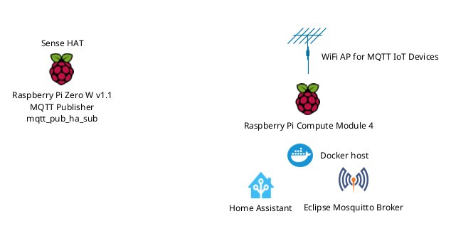

## Home Assistant, Eclipse Mosquitto Broker and libmosquitto publisher

In this subproject MQTT publisher implemented with libmosquitto, collects ambient data from Pi Sense HAT sensors and publish them in JSON format on a dedicated channel via Eclipse Mosquitto broker. Home Assistant plays the role of the MQTT subscriber. The entities defined in Home Assistant are subscribed to the channel on the same broker and they collect the ambient data.

### Main components
- **Home Assistant**: deployed on Raspberry Pi Compute Module 4 and running in Docker container;
- **Eclipse Mosquitto broker**: instance of the broker running in Docker container on the same host as Home Assistant;
- **mqtt_pub_ha_sub**: the publisher of the ambient data, deployed on Raspberry Pi Zero W v1.1 with Raspberry Pi Sense HAT attached.



[](https://creativecommons.org/licenses/by-nc-sa/4.0/)

The Docker host acts as WiFI access point for the IoT devices which want to publish data via MQTT.
  
### Software

 - [Libmosquitto library](https://mosquitto.org/), installed from Raspbian OS repositories (at the time of writing, Raspbian OS version 11 includes version 2.0.11 of the library in the official repositories);
 - [Libsetila library](https://github.com/positronic57/libsetila). C++ library for communication with the sensors on Pi Sense HAT, v0.5.7 or newer;
- [libjsoncpp library](https://github.com/open-source-parsers/jsoncpp) for formatting the MQTT payload as JSON (at the time of writing, Raspbian OS version 11 includes version 1.9.4 of the library in the official repositories); 
 - CMake v3.5 or newer for building the project from source;
 - Eclipse Mosquitto broker, as the latest Docker image;
- Home Assistant v2024.3.1 or newer.
 
### Hardware
- Raspberry Pi Compute Module 4 with 4GB RAM, WLAN and  M2.NMVe SSD. It is a Docker host running Debian GNU/Linux 12 (bookworm);
- Raspberry Pi Zero W v1.1 as MQTT publisher with Debian GNU/Linux 11 (bullseye);
- Raspberry Pi Sense HAT connected to the Pi Zero W.
	
### How it works

**The publisher mqtt\_pub\_ha\_sub** writes on the topic
`"home/ambient_data/living_room"`, the environment data it collects as readings from the sensors on Raspberry Pi Sense HAT. The environmental data include: a temperature, an atmospheric pressure and an air humidity, all placed together in one JSON document:
```
{
	"temperature" : 27.5,
	"pressure" : 1005.5683,
	"humidity" : 55.5
}
```
Using a separate external library like libjsoncpp for creating such a simple JSON document is an overkill. The same can be achieved with simple `std::string` manipulation.

The MQTT messages is send with *QoS (quality of service) flag* set to 0, and *retain* field set to *false*.

**Eclipse Mosquitto MQTT broker**. The broker does not allow clients to connect without authentication. 	The MQTT clients from this project (Home Assistant as MQTT subscriber and mqtt\_pub\_ha\_sub as MQTT publisher) must authenticate with a username and a password before using the services of the broker. The data transfer is done via plain MQTT without TLS protection. Because the code of mqtt\_pub\_ha\_sub is for demonstration purposes only, the authentication data are hard coded in the source code which from a security perspective is the worst way of storing and using credentials.  

**Home Assistant, the subscriber side**. The definitions of the MQTT devices/sensors in Home Assistant contains the same MQTT topic used by the mqtt\_pub\_ha\_sub for publishing its ambient data. Each device corresponds to one sensor on Raspberry Pi Sense HAT. The definitions of the sensors are placed in a separate configuration file `mqtt_sensors.yaml` in Home Assistant configuration folder:
```
- name: 'Living Room Humidity'
  state_topic: 'home/ambient_data/living_room'
  device_class: humidity
  unique_id: "HTS221.humidity.sensor.1"
  value_template: "{{ value_json.humidity }}"
  unit_of_measurement: '%'
  device:
    name: "STM HTS221"
    manufacturer: "STMicroelectronics"
    model: "HTS221"
    identifiers:
      - "STM_HTS221"

- name: 'Living Room Temperature'
  state_topic: 'home/ambient_data/living_room'
  device_class: temperature
  unique_id: "HTS221.temperature.sensor.1"
  value_template: "{{ value_json.temperature}}"
  unit_of_measurement: '°C'
  device:
    name: "STM HTS221"
    manufacturer: "STMicroelectronics"
    model: "HTS221"
    identifiers:
      - "STM_HTS221"

- name: 'Living Room Atmospheric Pressure'
  state_topic: 'home/ambient_data/living_room'
  device_class: atmospheric_pressure
  unique_id: "LPS25H.pressure.sensor.1"
  value_template: "{{ value_json.pressure}}"
  unit_of_measurement: 'hPa'
  device:
    name: "STM LPS25H"
    manufacturer: "STMicroelectronics"
    model: "LPS25H"
    identifiers:
      - "STM_LPS25H"

```
This file is loaded in the main configuration file of Home Assistant `configuration.yaml` under `mqtt` configuration section:
```
mqtt:
  sensor: !include sensori.yaml
```

 

## Building the MQTT publisher from source

Before building the source code on Raspbian OS, make sure that libmosquitto-dev package is already installed. The package is available in the official Raspbian repositories. The same applies for libjsoncpp-dev.

    #sudo apt-get install libmosquitto-dev libjsoncpp-dev 

For Pi Sense HAT support, first install *[libsetila](https://github.com/positronic57/libsetila)* library v0.5.7. Check libsetilla installation manual for the instructions.

Change the macros which define the information for connecting to MQTT broker like: IP address/hostname, username and password.

CMake tool is selected for building the clients from the source. It is an out-of-source build which requires a 
separate folder for the compiling process. Navigate to the project folder, create a new subfolder and jump inside:

    #mkdir build && cd build

Execute the following command in order to create a building instructions for the release version of the binaries:

    #cmake ..

Compile the client with:
 
     #make
 
 The result of the build will be placed in the current `build` folder. It can be executed with:
 
    #./mqtt_pub_ha_sub


### Test
At start, the publisher will try to connect to the MQTT broker using the credentials provided in the source file.
After a successful connection, it will publish 10 samples of ambient data with sampling period of 1min.  

```
Pi Sense Hat sensor reading #1:
Pressure P = 1005.56[hPa]
Temperature T = 27.5146[°C]
Relative Humidity R = 68[%rH]

JSON payload for reading number #1
{"humidity":68.0,"pressure":1005.56,"temperature":27.51}

Pi Sense Hat sensor reading #2:
Pressure P = 1005.62[hPa]
Temperature T = 28.1625[°C]
Relative Humidity R = 67[%rH]

JSON payload for reading number #2
{"humidity":67.0,"pressure":1005.62,"temperature":28.16}

Pi Sense Hat sensor reading #3:
Pressure P = 1005.53[hPa]
Temperature T = 28.7229[°C]
Relative Humidity R = 65[%rH]

JSON payload for reading number #3
{"humidity":65.0,"pressure":1005.53,"temperature":28.72}

...
``` 

**WARNING:** 
The source is provided as it is without any warranty. Use it on your own risk!
The author does not take any responsibility for the damage caused while using this software.

**DISCLAIMER:**
The code is a result of a hobby work and the author is not affiliated with any of the hardware/components/boards manufacturers mentioned in the code, documentation or the description of this project. All trademarks are the property of the respective owners.